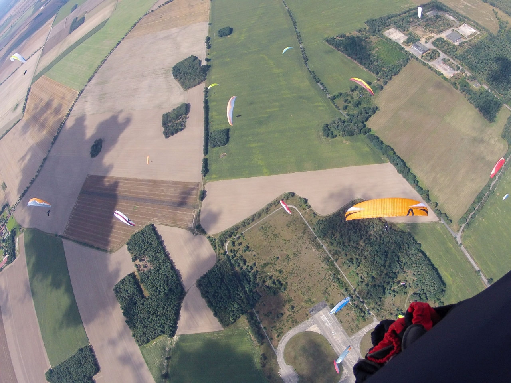

# Drachenflieger-Club richtet internationale Wettbewerbe aus

Vom 8. bis 20. August kämpfen Hängegleiter- und Gleitschirm-Pilot\*innen jeweils in drei separaten Wertungen um die Titel als Nord- und Ostdeutsche Meister sowie um einen Platz auf dem Siegertreppchen der German Flatlands. Bisher haben mehr als 140 Pilot\*innen ihre Teilnahme angemeldet - neben internationalen Spitzenpiloten sind darunter bekannte Namen aus der deutschen Liga, zahlreiche „Locals“ aus nord- und ostdeutschen Bundesländern und ambitionierte Nachwuchsflieger. Austragungsort ist das Fluggelände auf dem ehemaligen Militärflugplatz Altes Lager in Niedergörsdorf.

Die Drachenpilot\*innen eröffnen am 8. August die erste Wettbewerbs-Woche. Sie werden dabei von motorisierten Kleinst-Flugzeugen in die Höhe gezogen, bevor sie sich vom Schleppseil trennen. Wer das festgelegte Tagesziel in der kürzesten Zeit erreicht, gewinnt die Tagesaufgabe.

Ab dem 15. August wechselt das Teilnehmerfeld, und die Gleitschirmpilot\*innen fliegen dann um die Punkte. Sie starten an einem langen Seil per Windenschlepp. 

Beiden Wertungen gemeinsam ist, dass die Tagesaufgabe morgens vom demokratisch gewählten Task-Team erarbeitet wird. Je nach Wind- und Wetterprognosen wird das fliegerische Können der Teilnehmenden dabei mit one-way oder Ziel-Rück-Aufgaben gefordert. Die Flieger\*innen nutzen GPS-gestützte Fluginstrumente und suchen sich thermische Aufwinde („heiße Luft“), um das vorgegebene Ziel möglichst schnell zu erreichen. Die Distanzen für einen Task können mehr als 100km betragen, und führen je nach Windrichtung in verschiedene Teile des Flämings oder darüber hinaus.

Die German Flatlands sind für alle Pilot\*innen offen. Neben Teilnehmenden aus den nord- und ostdeutschen Bundesländern sind sie auch für internationale Wettbewerbspilot\*innen ein attraktives Event. So spricht die langjährige Drachenflug-Weltmeisterin Corinna Schwiegershausen gerne vom „Wetterwunder vom Fläming“: Am einstmals russischen Militärflugplatz „Altes Lager“ in Niedergörsdorf sind die Flugbedingungen oftmals auch dann noch gut, wenn die Piloten anderswo den Wolken nur vom Boden aus hinterher schauen können. 

Viele helfende Hände sorgen vor Ort für einen reibungslosen Ablauf der Wettbewerbe. Vor allem der sichere und zügige Start von 70 Pilot\*innen stellt hohe Anforderungen an die Helfenden bezüglich Logistik, Organisation und Kommunikation.

Veranstalter der nord- und ostdeutschen Landsmeisterschaften ist der Deutsche Hängegleiterverband (DHV), mit über 40.000 Mitgliedern die größte Luftsportorganisation der Welt. In ihm sind Hängegleiter- und Gleitschirmpilot\*innen organisiert, die das motorlose, naturnahe Flugerlebnis genießen. 

Ausrichter der German Flatlands ist seit 2003 der Drachenflieger-Club Berlin (DCB), der 1999 große Teile des ehemaligen russischen Militärflugplatzes „Altes Lager“ erworben und seither in ehrenamtlicher Arbeit zu einem international renommierten Schleppzentrum entwickelt hat.

Das Fliegen im Fläming rückt immer mehr ins Interesse der Öffentlichkeit. Auch die Anwohner von Altes Lager, Niedergörsdorf und Jüterbog kommen als Besucher auf das Fluggelände, fliegen als Passagiere mit oder erlernen sogar selbst das Drachen- oder Gleitschirmfliegen bei der auf dem Platz ansässigen Flugschule. Mittlerweile ist der DCB Fliegerverein stark mit dem Fläming verankert und weit über Brandenburg und Berlin hinaus bekannt.

Ansprechpartner für die Presse: Björn Gerhart, Berlin, +49 151 50813942, kontakt@dcb.org
Foto: Markus Henninger

