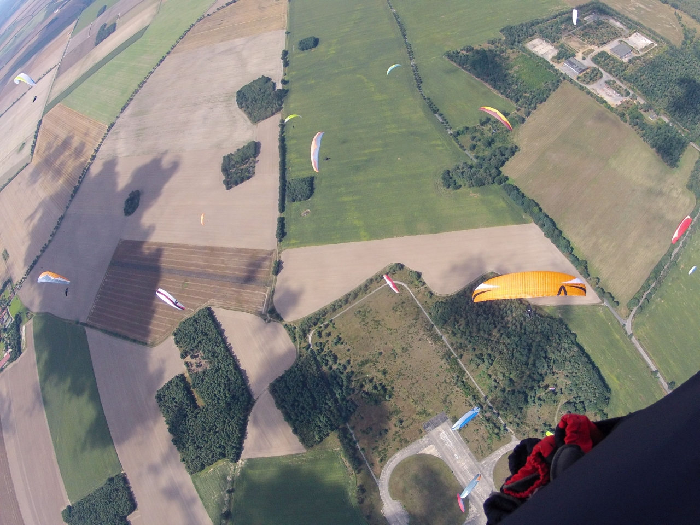

# Pressemitteilung zum Tag der offenen Tür 2022
## Niedergörsdorf aus der Vogelperspektive entdecken!
### Drachen- und Gleitschirmflieger\*innen organisieren Tag der offenen Tür auf dem Flugplatz Altes Lager

Die Pilot\*innen des Drachenflieger-Club Berlin e.V. laden Anwohner\*innen und Interessierte am Sonntag, den 4. September 2022 herzlich ein, die "lautlose Fliegerei" auf dem ehemaligen russischen Flugplatz Altes Lager kennenzulernen. Sie bieten dafür ein umfangreiches Veranstaltungsprogramm an.

Speziell ausgebildete Pilot\*innen des Vereins organisieren Passagierflüge für die Besucher, um die Faszination des Gleitschirm- und Drachenfliegens zu erleben, ganz ohne Vorkenntnisse. Anwohner\*innen erhalten damit die Möglichkeit, ihren Wohnort aus einer neuen Perspektive zu entdecken. Robustes Schuhwerk und Bekleidung bitte einpacken!

Wer selbst den Umgang mit dem Gleitschirm oder einem Hängegleiter ausprobieren möchte, ist bei der ansässigen Flugschule FlyMagicM willkommen. Sie bietet allen Interessierten einen Schnupperkurs an. Teilnehmende können sich dabei selbst mit dem Fluggerät vertraut machen, das rund 40.000 Pilotinnen und Piloten in Deutschland so viel Freude bereitet und mit dem schon Streckenflüge von mehreren 100 Kilometern absolviert wurden.

Gesorgt ist außerdem für das leibliche Wohl der Besucher.

Die Veranstaltung findet am Sonntag, den 4. September statt. Start ist 14:00 Uhr. Aktuelle Infos zur Veranstaltung und Anfahrt siehe https://www.dcb.org/besuchertag

Im Drachenflieger-Club Berlin e.V. sind etwa 220 Gleitschirm- und Drachenpiloten aus Brandenburg und Berlin organisiert. 2019 feierte er sein 40-jähriges Bestehen. Im Jahr 1999 hat der Verein hat den Flugplatz vom Land Brandenburg erworben. Er ist als Schleppzentrum des Deutschen Hängegleiterverbands (DHV) ein wichtiger Standort für die Aus- und Weiterbildung der Pilot\*innen aus ganz Deutschland. Seit 2003 finden hier regelmäßig die nord- und ostdeutschen Landesmeisterschaften der Drachen- und Gleitschirmflieger statt. Im kommenden Jahr sollen mit den German Open für Hängegleiter auch wieder internationale offene deutsche Meisterschaften ausgetragen werden. Den einstigen Militärflugplatz pflegen die Mitglieder des Vereins in Eigenleistung.

Ansprechpartner für die Presse: Björn Gerhart, Berlin, +49 151 50813942, kontakt@dcb.org

Foto: Markus Henninger

