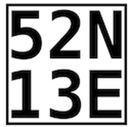

# Pressemitteilung zu den Flatlands 2026
## German Flatlands - internationale Pilotinnen und Piloten fliegen über Brandenburg um Titel, Punkte und den besten Thermiktag.

**Altes Lager/Jüterbog.** Rund 100 Pilotinnen und Piloten aus Deutschland und mindestens acht weiteren Ländern treffen sich Ende Juli und Anfang August zu den „German Flatlands“ auf dem Flugplatz Altes Lager südlich von Berlin.

Der Wettbewerb zählt zu den wenigen internationalen Streckenflug-Events im Flachland und bringt Spitzenpiloten ebenso wie ambitionierte Einsteiger in den Fläming.

Den Auftakt machen die Drachenflieger vom 27. bis 31. Juli 2026, gefolgt von den Gleitschirmfliegern vom 2. bis 8. August 2026. Geflogen werden täglich wechselnde Aufgaben über Distanzen von etwa 80 bis 180 Kilometern. Ziel ist es, vorgegebene Wendepunkte möglichst schnell zu erreichen und die Strecke in kürzester Zeit zu bewältigen.

Dass die Erwartungen für die diesjährigen Wettbewerbe hoch sind, zeigte bereits das Frühjahr. Schon im Mai wurden von hier aus mehrere Flüge über deutlich mehr als 200 Kilometer realisiert. Das Fluggebiet im Fläming gilt als eine der leistungsstärksten Thermikregionen im Flachland Deutschlands. An klaren Tagen reicht der Blick vom Startplatz bis zur Berliner Skyline oder weit über die Elbe hinaus.

Anders als in den Alpen gibt es im Fläming keine Berge als Starthilfe. Im Unterschied dazu erfolgt der Start im Flachland per Schlepp: die Gleitschirmflieger werden mit speziellen Seilwinden in die Luft gezogen. Die Winden werden mittlerweile überwiegend elektrisch betrieben, was dem Engagement der Mitglieder bei der Konstruktion der vereinseigenen Examplare zu verdanken ist. Die Drachenflieger starten hinter Ultraleicht-Trikes und werden so auf rund 600 Meter Höhe geschleppt.
Nach dem Ausklinken entscheiden allein Wetterverständnis, Taktik und das Auffinden der nächsten Thermik über den Flugerfolg.

Neben dem sportlichen Wettbewerb prägt auch das Gemeinschaftserlebnis die Veranstaltung. Gemeinsame Briefings am Morgen und die Auswertung der Flüge am Abend schaffen Raum für Austausch zwischen internationalen Teilnehmern.

Medienvertreterinnen und Medienvertreter sind eingeladen, die Veranstaltung vor Ort zu begleiten. Interviews, Foto- und Filmaufnahmen sowie Einblicke in die Organisation sind nach Absprache möglich.  Der Wettbewerb zeigt, dass anspruchsvoller Luftsport nicht nur in den Bergen stattfindet, sondern auch im Flachland vor den Toren Berlins.

## Kurzinfo: Drachenflieger-Club Berlin e.V.

Rund 220 Drachen- und Gleitschirmflieger aus Berlin und Brandenburg sind im DCB organisiert und fliegen vor allem von Frühjahr bis Spätherbst am Flugplatz Altes Lager bei Jüterbog.

[www.dcb.org](https://www.dcb.org/)

## Pressekontakt

Björn Gerhart, Öffentlichkeitsarbeit und Presse  
+49 151 50813942  
[kontakt@dcb.org](mailto:kontakt@dcb.org)
